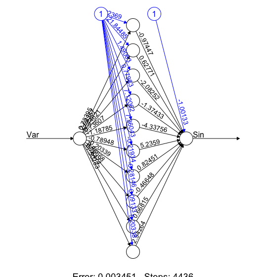

```{r setup, include=FALSE}
knitr::opts_chunk$set(echo = TRUE)
```

# Lab 1 

## Assignment 1 

### 1.1

```{r}

#setwd("Documents/732A95/lab1")

data <- read.csv2("lab1/spambase.csv",sep = ",", 
                  header = TRUE, stringsAsFactors = FALSE) # Reading data 

set.seed(12345)

# Dividing data in to a test and traning data set
n     <- dim(data)[1]    
id    <- sample( 1:n, floor(n*0.5) )
train <- data[id,]
test  <- data[-id,]

```

\newpage 

### 1.2 

As the instruction was a bit unclear on what features the function should be returning and what features the functions should had so my function returns a listobject with Distance-matrix, classifications, predicted values, confusion matrix and missclassification-rates for both train and test data. The function requires that the target value is located at the last column. 

```{r}
knearest <- function(data, K, newdata){

train <- data  
test <- newdata 

# i Compute xhat
xhat <- as.matrix( data[,-length(data)] ) 
xhat <- xhat / sqrt(rowSums( xhat^2 )) 

# ii Compute yhat
yhat <- newdata[,-length(newdata)]
yhat <- yhat / sqrt(rowSums(yhat^2))

# iii Compute matrix C as abs(c(Xi,Ymj))
C <-  xhat %*% t(yhat)  

# iv Compute the distance

D <- 1 - C 

#Returns orders for each column (the lowest value is the fist value)
myOrders <- apply(D,MARGIN = 2, FUN = order) 

#Keeps the K lowest values in the distance matrix
myOrders <- matrix(myOrders[1:K,], nrow=K)  

#Extracts the K number of values of the observed y-variables
myData<-train[myOrders[1:K,],length(train)]  

#puts the y-observations in a matrix where each column represents a column
myData<- matrix(myData,nrow=K,byrow = FALSE)  

#Majority voting 
myClass<-apply(myData,MARGIN = 2, FUN =function(X) round(mean(X)))  

#Generating predictions for 1.6 
myPredict<-apply(myData,MARGIN = 2, FUN =function(X) mean(X))  


#missclassification rates for training and test 
mcr<- c(1 - mean(myClass == test[,length(test)]))  
#mcrTrain <- 1 - mean(myClass == train[,length(train)])  
#mcr<-c(Test = mcrTest, Train = mcrTrain)

#Confusion-matrix for the training and test dataset
minRejm           <- data.frame(myClass = myClass)  
minRejm$myTest    <- test[,length(test)] 
minRejm$myTrain   <- train[,length(train)] 
cmTest <- table(myClass = minRejm$myClass,myTest  = minRejm$myTest)  
cmTrain<- table(myClass = minRejm$myClass,myTrain = minRejm$myTrain)  


returnlist<-list(D = D, myClass = myClass, 
                 cmTest = cmTest,cmTrain = cmTrain,
                 mcr=mcr,myPredict=myPredict) 
 
return(returnlist)


}  

```

\newpage 

### 1.3

```{r,message=FALSE, warning = FALSE}
mytest<-knearest(train, K = 5, test)
```

```{r,echo = TRUE}
print("For the traning-set")
print(knearest(train, K = 5, train)$mcr)
print("For the test-set")
print(mytest$mcr)
```
A missclassification rate around 30 % can be considerd a good fit for the test data set. 

First the confusion matrix for the training dataset 
```{r,echo = TRUE}
print(mytest$cmTrain)
```

Here are the confusion matrix for the test dataset.
```{r,echo = TRUE}
print(mytest$cmTest)

```

\newpage

### 1.4
And now when K equals 1. 

```{r,message=FALSE}
myKN<-knearest(train, K = 1, test)
```

```{r,echo = TRUE}
cat("Missclassification rate for the traning-set")
cat(knearest(train, K = 5, train)$mcr)
cat("For the traning-set")
cat(myKN$mcr)
```

First the confusion matrix for the training dataset 
```{r,echo = TRUE}
print(myKN$cmTrain)

```

and here is the confusion matrix for the test dataset.
```{r,echo = TRUE}
print(myKN$cmTest)

```

The K = 1 preforms worse than the K = 5, which isn't that strange as a voting process with one observation is a complex model and is over-fitting the data as the voting process would be basicly assuming the closest neighbouhr has the same value as the one it's calculated from, which probably isn't a good asumption to make.

\newpage

### 1.5


```{r}

testKNN <- function(KKNpred,pi){
  a       <- data.frame(pred = as.numeric( KKNpred > pi ))
  a$test  <- test[,length(test)]
  return(table(a))
}

library(kknn)
kknnearest <- kknn(Spam~., train, test, distance = 2, k = 5)

tab1<-testKNN(predict(kknnearest),0.5)
print(tab1)
print((1 -sum(diag(tab1))/(sum(tab1[,1])+sum(tab1[,2]))))

```

The missclassification rate is higher for the test-data set compared to knearest with K = 5. Which is notable, the kknn-model has a missclassification rate comparable with the knearest-model with K = 1, although this dosn't mean the kknn-model is overfitted as the knearest(K=1), the decision boundaries for the kknn model is although not good for this data set. 

### 1.6

```{r,echo = TRUE}

rocKalk <- function(predictions,pi = 0.5){
  a       <- data.frame(pred = as.numeric( predictions > pi ))
  a$test  <- test[,length(test)]
  confmat<-table(a)
  TPR<-sum(confmat[2,2])/sum(confmat[,2])
  FPR<-1 - sum(confmat[1,1])/sum(confmat[,1])
  return(data.frame(TPR = TPR, FPR = FPR))
}


mypi<-seq(0.05,0.95,0.05)
i <- 1
rocMyFunk <- data.frame(matrix(ncol= 2 ,nrow = length(mypi))) 
for (n in mypi){ 
rocMyFunk[i,1]<-rocKalk(predictions = mytest$myPredict, pi=n)[[1]] 
rocMyFunk[i,2]<-rocKalk(predictions = mytest$myPredict, pi=n)[[2]] 
i <- i + 1  

  }        
rocMyFunk$X1<- as.numeric(rocMyFunk$X1) 
rocMyFunk$X2<- as.numeric(rocMyFunk$X2) 
colnames(rocMyFunk) <- c("TPR","FPR") 


mypi<-seq(0.05,0.95,0.05) 
i <- 1
rocKKNN <- data.frame(matrix(ncol= 2 ,nrow = length(mypi))) 
for (n in mypi){ 
  rocKKNN[i,1]<-rocKalk(predictions = predict(kknnearest), pi=n)[[1]] 
  rocKKNN[i,2]<-rocKalk(predictions = predict(kknnearest), pi=n)[[2]] 
  i <- i + 1  
  
}        
rocKKNN$X1<- as.numeric(rocKKNN$X1)
rocKKNN$X2<- as.numeric(rocKKNN$X2)
colnames(rocKKNN) <- c("TPR","FPR")

```


```{r,echo = TRUE }
library(ggplot2)

ggplot() + geom_line(data=rocMyFunk,aes(x = FPR, y = TPR,col="knearest")) + geom_line(data=rocKKNN,aes(x = FPR, y = TPR,col="KKNN"))

```

My own function knearest seems to have an larger area than the kknn function and should be the prefered model in this case

## Assignment 2

### 2.1

```{r, echo = TRUE}

machines <- data.frame(read.csv2("lab1/machines.csv"))
machines<-as.vector(unlist(machines$Length))

```

Read the data and transform it in to a vector. 


### 2.2 

The distrubution given is a exponential distrubution.
The pdf for the exponetial distrubution is: 

                 $p(x|\theta) = \theta e^-x\theta$

The likelihood is the following:

           $\prod p(x|\theta) = \theta e^-\theta\sum x_i$

Finaly the log-likelihood was computed to:

      $log\,p(x|\theta)=n\,log(\theta)-\theta\sum_{n=1}^N\mathrm{x_i}$

From this expression an R function was created called explog. 

```{r}

explog <-function(theta,data){
  
  return(     length(data)*log(theta,base = exp(1)) - (theta*sum(data))    )
}

```


```{r}

theta <- seq(0.001,5,by=0.01) #Generates a sequence of different 
thetaML <- sapply( X = theta, FUN = explog, data = machines) 
#apply the different thetas to the log-likelihood with the machine data-set.
plotData <- data.frame(x=theta,y=thetaML) #Put the data in a frame. 


#Plotting
library(ggplot2)
p <- ggplot() + geom_line(data=plotData,aes(x=x,y=y,col="All observations")) +
                labs(title=paste("Log-likelihood function over different  theta"),
       x=expression(theta),y="ML-estimate")

a <- p + geom_segment(aes(x = 3, y = -20, 
                          xend = theta[thetaML == max(thetaML)], yend = max(thetaML)),
                 arrow = arrow(length = unit(0.5, "cm"))) + 
  annotate("text",x=4,y=-19,label = paste("theta",theta[thetaML == max(thetaML)]))

plot(a)

```

The maximum in the plot for the log-likelihood of the different thetas is estimated to 1.131. 

\newpage

## 2.3 

```{r}

thetaML3 <- sapply( X = theta, FUN = explog, data = machines[1:6])
#Using only the 6 first observations of machines 
plotData$y2 <- thetaML3

p + geom_line(data = plotData, aes(x=x,y=y2,col="6 observations"))

```

The red line represents the log likelihood function of different theta using six observations. These observations seem to have a higher intercept than the teal line which represents the function using all observations in the machine dataset. The function using less data seem to reach a max-point at a higher theta value and the max isn't that defined in the function compared to the function using all data. This show the dependence of data with these estimators. 

\newpage

## 2.4

```{r}

postBayes <- function(data,theta){ 
  lambda <- 10 
  return(length(data) * log(theta) - theta * sum(data) +
           log(lambda) - (lambda*theta))
  
} 

thetaBayes <- sapply(theta,FUN = postBayes,data = machines)

plotDataBayes <- data.frame(x=theta,y=thetaBayes)
B <- ggplot() + geom_line(data=plotDataBayes,aes(x=x,y=y)) +
  labs(title="Bayes-posterior",
       x=expression(theta),y="Bayes-estimate")
plot(B)

```

This function calculates the posterior for different thetas. The max-value here is about 0.9 and thats a lower estimate of theta. 


\newpage

### 2.5 

```{r}
library(gridExtra)
#extract the exact theta for the  ML-estimate
maxTheta <- theta[thetaML == max(thetaML)] 
# Generate 50 random variables from the exponential distrubution with
# the ML-estimate extracted  
set.seed(12345)
randomExpData<- data.frame(x=rexp(50,rate = maxTheta))

#Plotting
ab<- ggplot(data = randomExpData,aes(x=x)) +
  geom_histogram(bins = 12) +
  labs(title = "Randomly drawn data from rexp")
abc<- ggplot(data =data.frame(x=machines),aes(x=x)) + 
  geom_histogram(bins = 12) + 
  labs(title = "The machine data-set")

 grid.arrange( ab, abc, ncol=2)

```

The distribution of the data-set machines have similar properties as the randomly drawn values from the exponential distribution with the Maximum Likelihood estimaded theta. The most noteworthy difference is that the machines data set dosn't seem to have the initial peak as the exponential-distrubution should have. It decreases constantly instead of a initial increase and then decreasing. But over all it seems resonable to assume its an exponential distrubution because of the low amount of observations it's hard to demand a better fit. 

\newpage

# Lab 2

## Assignment 1 

### 1.1 


```{r }
## 1.1 

myLM <- function(Y, X, Nfolds){
  library(ggplot2)
  # DEFINING THE FUNCTION LINREG, FOR FITTING LINEAR MODELS 
  
  linreg<-function(formula,data){
    formula <- formula(formula)
    des.mat <- model.matrix(formula , data) #Extracts the model matrix
    dep.var <- all.vars(formula)[1]         #Extracts the name of the y-variable 
    dep.var <- as.matrix(data[dep.var])     #Extracts the data of the y-variable 
    # and overwrites it with the data-colum 
    
    #Calculating the beta coeffs. (X' %*% X)^-1 %*% X' %*% y
    beta.hat <- solve( t(des.mat) %*% des.mat )  %*% t(des.mat) %*% dep.var
    
    # Calculating the y-hat  , y_hat = X %*% beta_hat
    y.hat <- des.mat %*% beta.hat  
    
    #Calculating the residuals e= y- y_hat
    res.err <- dep.var - y.hat   
    
    l<-list( beta.hat = beta.hat, y.hat = y.hat, res.err = res.err)
    return(l)
  }
  
  
  #GENERATING ALL POSSIBLE PERMUTATIONS OF MODELS
  
  #Get the colnames for the X-variables
  q<-rep(paste0("X",c(1:5)))
  
  #Merge the data in to one data set and naming the columns
  myData <- cbind(Y,X) 
  colnames(myData)<- c("Y",q)
  
  #Generating all possible combinations 
  myComb<-sapply(c(1:5), FUN = combn, x = q )
  #Creating the vector that will hold all formulas 
  myformula <- c(myComb[[1]])
 
  #Extracting the combinations of 2 and 3 X-variables and adding a + between them
  for (i in 2:3){
    for (j in 1:10){
      myformula[length(myformula)+1]<-(paste(myComb[[i]][,j],collapse = " + "))
    }
  }
  
  #Heres two rows that could replace the above for-loop
  #sapply(2:3, FUN = function(i) sapply(1:10, FUN = function(j)
  #paste(myComb[[i]][,j], collapse = " + " ) ) )
  
  
  #Extracting the combinations of 4 and 5 X-variables and adding a + between them
  #This is basicly a loop for the 4 combinations 
  myformula <-c(myformula ,
                sapply(1:5, FUN =function(X)
                  paste(myComb[[4]][,X],collapse = " + " ) 
                  ),  paste(myComb[[5]],collapse = " + ")  
                )
  
 myformula<- paste("Y","~",myformula)
 
 #### SPLITTING AND SUBSETING DATA IN TO K FOLDS
 
 #calculatin no. rows
 noobs<-dim(myData)[1]
 K <- Nfolds
 
 #Use sample to randomly draw the indexes of the dataset
 #and reorder the data with them in a random manner
 set.seed(12345)
 myData<-myData[sample(noobs),] 
 
 #Create K equal indexes that are added to the data.
 cut(1:noobs,breaks=K,labels = FALSE)
 
 myData$index <- cut(1:noobs,breaks=K,labels = FALSE)
 

 #init a counting vector "o" useed to loop in to the data.frame "linearModels"
 #and a combination index "dataKombs" used for subseting the different datasets
 #used for fitting models
 o <- 1 
 linearModels<-data.frame(CV=1,model="text",nofeats=1,stringsAsFactors = FALSE)
 dataKombs <- combn(1:K,K-1)
 for (m in 1:length(myformula)){   
 for (l in (1:K)){  

   #the data of the K-folds used for the model estimation    
   data<-subset(myData, myData$index %in% dataKombs[,l] )


   #the fold that was left out in the model estimation
   predmatrix<-model.matrix(formula(myformula[m]), 
             subset(myData, !(myData$index %in% dataKombs[,l] ))) 
   
   

   #Calculating the CV score for each model. sum((Y - Y(hat))^2)
   CV<-sum(
     (  
       #this is the observed Y for the left out fold.
       subset(myData, !(myData$index %in% dataKombs[,l] ))[,1] -
        #predmatrix description above.
        predmatrix %*%  
        #the estimated beta-hats. 
        linreg(formula = myformula[m], data = data)$beta.hat 
       )^2
     )
   
   #inserting the results in to the linearModels data.frame
   linearModels[o,] <- c(CV,myformula[m],ncol(predmatrix) - 1)
   o <- o + 1 
    }
 }
 #reforming data to numeric again. 
 linearModels[,1] <- as.numeric( linearModels[,1])
 linearModels[,3] <- as.numeric( linearModels[,3])
   
 #The mean for the different models, each model is estimadet K times  
 plotdata<-suppressWarnings(aggregate(linearModels,by = list(linearModels$model),FUN= mean)[,-3])
 
 #renaming a column to ease plotting
 colnames(plotdata)[1] <- "Model"
 
 #plotting
 engr<-ggplot() +
   geom_line(data = aggregate(plotdata,list(plotdata$nofeats),FUN = min)[,c(3,4)],aes(x=nofeats,y=CV)) +
   geom_point(data = plotdata,aes(x=nofeats,y=CV,col = factor(nofeats)) ) +
       labs(title = "CV scores for different no. feats",color = "No. feat")
 
 
#displays the plot 
plot(engr)

 #Returns the models with the lowest average CV-score 
 return( plotdata[min(plotdata$CV) == plotdata$CV,c(1,3,2)])

}  

```

###1.2 

```{r swiss, echo=TRUE}
##1.2 

myLM(Y = swiss[,1], 
     X = swiss[ , 2:ncol(swiss) ], 
     Nfolds = 5 )
```

The CV-plot shows the cross validation-score (CV-score) for each of the models, each score corresponds to a model fitted against the response. When no. features (X-variables) is one each dot corresponds to the CV-score that is the average SSE of K (five in this case) models with one variable fitted against the respond. The plot shows how both the variation and mean decreases when the number of features increases. The lowest variation and mean for the CV-score (disregarding no. feats = 5) is models with 4 features. The three best models are one with 3, 4 and 5 features whereas the model with 4 features has the lowest CV-score and the most appropriate model.

The best subset to predict Fertility is Agriculture, Education, Catholic and Infant Mortality. It seems reasonable that these have impact on the Fertility rate as Agriculture, Education and Infant Mortality probably serves as good indicators for well-being in the town. The share of Catholics in the town could be explained by their belief that various methods of birth-control is some kind of a sin or that they don't belive in sex before marrige. The percentage of draftees receiving highest mark on army examination is the one variable that is left out and it doesn't seem weird, as it doesn't have any direct empirical connections to the fertility rate. 

\newpage 

#Assignment 2

### 2.1 

```{r}
## 2.1

TC<- read.csv2("lab2/tecator.csv")

ggplot(data = TC, aes(x=Protein,Moisture)) + geom_point()
```

A linear model with Protein as a predictor would be a good fit to the variable Moisture. Except for some outliers to the left of the plot and some low observations for Moisture when Protein is observed between 17  - 20. 

## 2.2 
\begin{center}
$p(M_i) = p(y|\mathbf{w},x) = N(w_0 + \sum_{1}^i( x_1^i  w_i),\sigma^2)$ 
\end{center}
Where sigma-squared can be written as follows for each $M_i$ 

\begin{center}
$\epsilon \sim N(0,\sigma^2)$ 
\end{center}

The $\sigma^2$ is the expected variance. As long as the normality assumption (where the error terms has a mean of zero and a variance of sigma square) holds it is appropriate to assume that the minimized MSE from the training data as it is an unbiased estimator. Although in reality the model with the lowest MSE isn't the most appropriate due to over fitting of data.   

### 2.3 

```{r}

## 2.3

set.seed(12345)
obs   <- dim(TC)[1]
id    <- sample(1:obs, floor(obs*0.5))
train <- TC[id,]
valid <- TC[-id,]


  dataMSE <- data.frame(trainMSE = 1, testMSE = 1, noPoly = 1)
  i <-1 
  
for (modell in 1:6) {  

  linj<-lm(formula(paste("Moisture ~",paste("I(Protein^",1:modell,")", collapse = " + "))),data = train)
  trainMSE<-mean(linj$residuals^2)  
  testMSE<-mean( (predict(linj,newdata = valid) - valid$Moisture)^2)
  dataMSE[i,] <- c(trainMSE,testMSE,i)
  i <- i + 1
  
} 
  
 aplot<- ggplot(data = dataMSE) + 
    geom_line(aes(x = noPoly ,y = trainMSE, col = "Train")) +
    geom_line(aes(x = noPoly ,y = testMSE, col = "Test")) +
    labs(title="MSE for different polynomial functions",
         color ="MSE", x="Flexibility", y = "MSE")
  plot(aplot)
  

```

In the beginning of the plot the training data has a higher error rate than the test data which is probably a coincidence where the outliers were mostly placed in the traning data set. But it definitly seems like a linear model is most apropriate as it has the lowest MSE for both test and traning set. 

When the training MSE decreases rapidly when the flexibility (no. parameters) increases. At the same time the MSE for increases. This is a statment of the overfitting as the traning model says it get better (lower MSE) but in reality it only improves the fit for the data given and not for any new observations.


### 2.4 

```{r}
##2.4

library(MASS)
varSelect<-lm(Fat ~ . , data = TC[,2:102])
stepRes<-stepAIC(varSelect,trace = FALSE)
cat(length(stepRes$coefficients) - 1)

```

The stepAIC variable selection function kept 63 of the 100, in total it removed 37 of the variables.

### 2.5

```{r,message = FALSE, warning = FALSE }

## 2.5

library(glmnet)
library(reshape2) 
wideWeg <- glmnet(x = as.matrix(TC[,2:101]), y = TC[,102], alpha = 0)
mycoeffs <- coefficients(wideWeg)[-1,]
colnames(mycoeffs) <- wideWeg$lambda

myPlot<-melt(as.matrix(mycoeffs),id = rownames,c("lambda","coef"))

colnames(myPlot) <- c("features","lambda","coef")


ggplot(myPlot,aes(x=log(lambda),y = coef,color = features)) + geom_line(show.legend = FALSE) + labs(x = expression(log(lambda)) )

```

In this plot each line represents a variable ChannelX and how these are penalized by the lambda-value. When $\log(\lambda)$ increases the more each of the variables get penalized and the coefficients move closer to zero depending on it's value to the model. When a line is further away from the line where y = 0 the more impact to the model it brings. So the green lines at the top of the lines has the most relevance in the plot.

Around  $log(lambda) = 1.25$ the irregular patterns in the lines seem to stop and assume a more smoothed pattern. At a $\log(\lambda)$ value around 5 almost all coefficients have converged at near zero and have no or little effect to the model. 


### 2.6

```{r}
## 2.6

lassoReg <- glmnet(x = as.matrix(TC[,2:101]), y = TC[,102], alpha = 1)
mycoeffs <- coefficients(lassoReg)[-1,]
colnames(mycoeffs) <- lassoReg$lambda

myLasso<-melt(as.matrix(mycoeffs),id = rownames,c("lambda","coef"))

colnames(myLasso) <- c("features","lambda","coef")


ggplot(myLasso,aes(x=log(lambda),y = coef,color = features)) +
  geom_line(show.legend = FALSE) + labs(x = expression(log(lambda)) )

```

As in the previous plot a line closer to zero mean a less useful model. A difference here is that the Lasso-model actually zero and removed and not kept very close to zero as in the Ridge-regression. This gives Lasso-models in general easier enterpretations as the number of variables are kept down. 

One variable seem to have a large impact regardless of the $\log(\lambda)$ value, it's the one with highest values on coef. 

When $\log(\lambda)$ is between -5 and -3 there are a number of variables that still are non-zero in the model. After that the number of variables decrease but some variables get a big importance boost at various rates of $\log(\lambda)$ which is shown by the up and down pattern in the mustard-yellow and orange lines. When $\log(\lambda)$ is 2 every variable except the green line has lost it influence on the model and their coefficients are equal to zero. 

Compared to the Ridge regression the Lasso model seem be a bit more nuanced in its way of selecting variables that have impact on the model. The Lasso also don't remove all variables importance when lambda gets higher.

### 2.7

```{r}
## 2.7
set.seed(12345)
cvLASSO<-cv.glmnet(x = as.matrix(TC[,2:101]), y = TC[,102], alpha = 1)

nocoeff<-matrix(coef(cvLASSO,s ="lambda.min"))
nocoeff[nocoeff != 0]
cat(paste("The no. of variables included in the optimal model was: ",length(nocoeff[nocoeff != 0]) - 1))
cat(paste("The lambda of the optimal model was: ",cvLASSO$lambda.min))#antalet coeff exklusive intercept.
plotLasso<- data.frame(CV=cvLASSO$cvm,lambda= cvLASSO$lambda)

ggplot(data=plotLasso,aes(x = log(lambda), y = CV)) + geom_point() + 
  labs(x = expression(log(lambda)) )


```

The CV score seems to increase as the $\log(\lambda)$ increases. So as we increase lambda we increase the MSE which would imply that we remove information (i.e. under fit) as we increase lambda. In this case when $\log(\lambda)$ reaches 0 it can not remove any more variables as there is only one left and instead start decreasing the last coefficient until it can't go any lower. 

### 2.8 

The Cross Validation in Lasso has 12.65335 a MSE for the optimal model and uses only 14 parameters compared to the stepAIC which removed 36 variables. The LASSO-model seem to penalize complex models in a better way than the stepAIC which stops with a model  one could assume still is a too complex model to be considerd a good fit.


\newpage

# Lab 3 

## Assignment 1 

### 1.1 

```{r}
crabs <- read.csv("lab3/australian-crabs.csv")
library(ggplot2)
p<- ggplot(data = crabs) + geom_point(aes(x = RW, y =CL, col = sex)) + 
  labs(title = " CL vs RW", caption = "australian crabs dataset")
plot(p)

```

A line would be able to separate the genders pretty well. One could expect a couple of missclassifications when the variables has low values as the genders seem to have less separation there. 

\newpage

### 1.2 


```{r, echo = TRUE}
LDA<- function(X){

RW <- X[,1]
CL <- X[,2]
sex<- X[,3]
myMu <- aggregate(cbind(RW,CL),by = list(sex), FUN = mean, simplify = TRUE)
myCov <- by(cbind(RW,CL), list(sex), cov, method = "pearson")
myPi <- aggregate(cbind(RW,CL),by = list(sex), FUN =function(x) length(x)/nrow(cbind(RW,CL)), simplify = TRUE)


mySig<- (( myCov[[1]] * myPi[2,2] * length(RW) ) + (myCov[[2]] * myPi[2,3] * length(RW)) ) / nrow(X)


woMale <- -0.5 * as.matrix(myMu[2,2:3],ncol = 2) %*% solve(mySig) %*% t(myMu[2,2:3]) + log(myPi[2,3])
woFem <- -0.5 * (as.matrix(myMu[1,2:3],ncol = 2)) %*% solve(mySig) %*% t(myMu[1,2:3]) + log(myPi[1,3])


wM<- solve(mySig) %*% t(myMu[2,2:3])
wF<- solve(mySig) %*% t(myMu[1,2:3])
  

a <- (woMale - woFem) 
b <- wM - wF
x <- cbind(X[,1:2])

#w0s is a 
#w1s is b[1]
#w2s is b[2]
myInter <- as.numeric(-a/b[2]) 
mySlope <- as.numeric(-b[1]/b[2])

X$myClass<-t(ifelse((a[1] + t(b) %*% t(x)) > 0 ,levels(X[,3])[2],levels(X[,3])[1]))
colnames(X)[4] <- "Predicted" 
retObj<-list(w0 = c(woMale,woFem),
             w1 = cbind(wM=wM,wF=wF), 
             myClass = X,
             myModel = c(myInter = myInter, mySlope = mySlope))

return(retObj)
}
```

The return object of the LDA-function returns a list with all answers and the decision boundary. 

To get the decision boundary we have the set the two discriminantfunctions equal to each other and solve for one of the parameters depending on X so that we get where they intercect. 


$\delta_k(x) = x^T\Sigma^{-1}\mu_k + (-1/2)\Sigma^{-1}\mu_k +  log(\pi_k)$

$w_{i} = \Sigma^{-1}\mu_i$
$w_{oi} = (-1/2)\Sigma^{-1}\mu_k +  log(\pi_k)$

$\delta_{male}(x) = \delta_{female}(x)$

$\delta_{male}(x) - \delta_{female}(x) = 0$

$x^T(w_{Male} - w_{Female}) + (w_{0 Male} - w_{0 Female}) = 0$

$x^T_{CL}(w_{Male} - w_{Female}) +x^T_{RW}(w_{Male} - w_{Female}) + (w_{0 Male} - w_{0 Female}) = 0$


$x_{RW}(w_{Male} - w_{Female}) + (w_{0 Male} - w_{0 Female}) = -x_{CL}(w_{Male} - w_{Female})$

And we arrive the final result as. 

$\frac{(x_{RW}(w_{Male} - w_{Female}) + (w_{0 Male} - w_{0 Female}) )}{ -(w_{Male} - w_{Female})} = x_{CL}$

This is expressed as y = CL and x = RW, which means this decision boundary needs to be plottet with the right variable on the right axis.

\newpage

### 1.3 


```{r}
results <- LDA(crabs[,c(5,6,2)])
## 2.3
#actualdata + desicion boundaries
#p + geom_abline(intercept = results$myModel[1], slope = results$myModel[2], col = "Red")

#predicted classes + desicion boundaries
ggplot(data = results$myClass) + geom_point(aes(x = RW, y =CL, col = Predicted)) + geom_abline(intercept = results$myModel[1], slope = results$myModel[2], 
    col = "orange") + 
  labs(title = "Predicted values for the LDA() with a decision boundary")

```


The line was calculated to 

$$`r results[[4]][1]`+ x^T_{RW}(`r results[[4]][2]`)   = x^T_{CL} $$

The decision line divides the data nicely but i has some issiues when RW is below 12 where the two groups are closer in distance. 

The two discriminant functions were calculated to 

$$\delta_{male}(x) = x^T(`r results[[1]][1]`) + `r results[[2]][1]`  $$
$$\delta_{female}(x) = x^T(`r results[[1]][2]`) + (`r results[[2]][2]`)$$ 

\newpage

### 1.4

```{r}
myLogit<-glm(sex~RW + CL, family = binomial(link='logit'), data = crabs )

myDecLog<-coef(myLogit)[1:2]/-coef(myLogit)[3]

ggplot(data = results$myClass) + geom_point(aes(x = RW, y =CL, col = ifelse(myLogit$fitted.values > 0.5,1,0)), show.legend = FALSE) +
  geom_abline(intercept = myDecLog[1], slope = myDecLog[2]) 


```

One visible difference in the plots are that an observation located close to the line at CL = 37 and RW = 14 is now classified as a male wheras it was classified as a female. Other than this it is hard to disguinsh any visible diffrences. 

The line was calculated as follows.

$$\frac{b_0 + b_{RW}}{b_{CL}}    $$

```{r}
cat("For the Logistic regression \n")

t(table(Predicted = ifelse(myLogit$fitted.values > 0.5,"Male","Female"),
      Observed = crabs$sex))
cat("\n")
cat("For the LDA:\n")
t(table(Predicted = results$myClass[,4] , Observed = crabs$sex))
```

Both classifiers has the same missclassificationrate 7/200 and has the same amount (but not necessery the same) of missclassifications in the anti-diagonals for the different categories. 

\newpage

## Assignment 2 

### 2.1 

```{r}
CS <- read.csv2("lab3/creditscoring.csv")

#Suffle the rows
set.seed(12345)
CS <- CS[sample(nrow(CS)),]

#Divide them up in different sets 
csTrain <- CS[1:(nrow(CS)*0.50),]
csValid <- CS[((nrow(CS)*0.50)+1):floor(nrow(CS)*0.75),]
csTest  <- CS[((nrow(CS)*0.75)+1):nrow(CS), ]
```

### 2.2 

```{r, echo = TRUE, message = FALSE}
library(tree)
library(partykit)

myreturn<-matrix(ncol=2,nrow=2)
colnames(myreturn) <- c("Train","Test")
rownames(myreturn) <- c("Deviance","Gini")


#For the deviance 
tDev <- tree(good_bad~ ., data = csTrain, split = "deviance")

predVals<-predict(tDev,newdata = csTrain) 
trainTable<-table(predicted = ifelse(predVals[,1] > predVals[,2], "bad","good"), Train= csTrain$good_bad)

myreturn[1,1]<-(1-sum(diag(trainTable))/nrow(csTrain))

predValsT<-predict(tDev,newdata = csTest) 
testTable<-table(predicted = ifelse(predValsT[,1] > predValsT[,2], "bad","good"), Test= csTest$good_bad)

myreturn[1,2]<-(1-sum(diag(testTable))/nrow(csTest))

#For the Gini

tGin <- tree(good_bad~ ., data = csTrain, split = "gini") 

predValsGin<-predict(tGin,newdata = csTrain) 
giniTab<-table(Predicted =ifelse(predValsGin[,1] > predValsGin[,2], "bad","good"),Test=csTrain$good_bad)


myreturn[2,1]<-(1-sum(diag(giniTab))/nrow(csTrain))
 
predValsGinT<-predict(tGin,newdata = csTest) 
giniTabT<-table(Predicted=ifelse(predValsGinT[,1] > predValsGinT[,2], "bad","good"),Test=csTest$good_bad)

myreturn[2,2]<-(1-sum(diag(giniTabT))/nrow(csTest))

knitr::kable(myreturn)

```


The Gini splitting criterion has a higher training and missclassification rate than the deviance splitting criterion. So for the following step the deviance criterion is used. 

\newpage

### 2.3 


```{r, echo = TRUE}
valid23 <- data.frame(trainS=1,testS = 1)
tDev2 <- tree(good_bad~ ., data = csTrain, split = "deviance")
rad <- 1 

  for (i in 2:15) {  
    tDev22         <-      prune.tree(tDev2, best = i)
    valid23[rad,1] <-      deviance(tDev22)
    valid23[rad,2] <-      2 * deviance(predict(tDev22,newdata = csValid,type = "tree"))
    rad <- rad + 1 
}

valid23$best <- 2:15
ggplot(data = valid23,aes(x=best)) + geom_line(aes(y=trainS),col="red") + geom_line(aes(y=testS),col = "blue") + 
  labs(title = "The optimal number of leafs", x= "Number of leaf nodes", y= "Deviance")


```
Validation is represented as the blue line and Traning as the red line, the deviance-fuction uses a summation over all observations in each data set. Since the validation is half the number of observations the validation deviance is doubled to get a more logical graph to interpret in a bias/variance trade off way. 

The optimal tree is the the one with 4 leafs is the optimal tree as it has the lowest validation deviance weher the training deviance is the lowest before it starts to rise again. 

```{r}

best<- prune.tree(tDev2, best = 4)
summary(best)
predTest<-predict(best,csTest)
tT<-table(ifelse(predTest[,1]>predTest[,2],"bad","good"),csTest$good_bad)
paste("Missclassification rate for test data",1-(sum(diag(tT))/nrow(csTest)))
```

The tree uses the variables Savings, duration and history for the decision boundaries. The missclassification rate is 0.251 which is  worse than the initial model, although the mcr for the test (2.48) is actualy lower than the mcr for the traning data. 

```{r}
plot(best)
text(best)
```

We do not know about the variables so it is hard to see if these are resonable splits. One could guess that people with less than 2.5 (k is my interpretation) in savings are probably a person with a more straind economy and there for more likely to default. 


\newpage


### 2.4 

```{r}
library(e1071)
#??e1071
cat("Training data")
cat("\n")
baybay<- naiveBayes(formula = good_bad~., data=csTrain)
bBay<- table(Predicted = predict(baybay,newdata = csTrain), Observed = csTrain$good_bad)
print(bBay/nrow(csTrain))
1-sum(diag(bBay)) / nrow(csTrain)
cat("\n Test data")
cat("\n")
bBayTest<- table(Predicted = predict(baybay,newdata = csTest), Observed = csTest$good_bad)
print(bBayTest/nrow(csTest))
1-sum(diag(bBayTest)) / nrow(csTest)
```

The mcr is the same for both traning and test data, In the confusion-matrix the proportions are displayed instead of the raw numbers. These proportions looks to be very similary distrubuted compared to each other. Overall these predictions
are worse than the decision tree in 2.3. 

\newpage

### 2.5 

```{r}
rawprobs<-predict(baybay,csTrain,type = "raw")

rawBayes<- rawprobs[,2]/rawprobs[,1] #good/bad

lossMat<-matrix(c(0,10,1,0),ncol=2)


lossBayBay<-table(Predicted=ifelse(rawBayes > lossMat[2,1]/lossMat[1,2],"Good","Bad" ),Observed=csTrain$good_bad)
#table(Predicted=ifelse(rawBayes > lossMat[1,2]/lossMat[2,1],"Good","Bad" ),Observed=csTrain$good_bad)
print(lossBayBay)
1-sum(diag(lossBayBay)) / nrow(csTrain)

rawprobsTest<-predict(baybay,csTest,type = "raw")

rawBayesTest<- rawprobsTest[,2]/rawprobsTest[,1] #good/bad
lossTable<-table(Predicted=ifelse(rawBayesTest > lossMat[2,1]/lossMat[1,2],"Good","Bad" ),Observed=csTest$good_bad)
print(lossTable)
1-sum(diag(lossTable)) / nrow(csTest)


```

We now classify more observations as Bad although they are Good. That has to do with the Lossfunction we implemented that says that we need to be 10 times as sure than normal. Because of this every observation that would normaly be classified as "good" when the probability for good is larger than bad now needs to be 10 times larger than bad for it to be good. 

This is a powerfull tool if we want to minimize a certain amount of False positives or True positives depending on the case. In this case a bank don't want bad lenders to be predicted as good people as that would be more hurtful for the bussiness and the bank don't want to give people the benefit of the doubt and rather take secure earnings.  

\newpage

# Lab 4


## Assignment 1 

### 1.1 

```{r}
library(ggplot2)
library(tree)
library(boot)
library(grid)
library(fastICA)
library(gridExtra)


State <- read.csv2("lab4/State.csv")
State <- State[order(State$MET),]

a11 <- ggplot(data = State, aes(x = MET,y = EX)) + geom_point()
plot(a11) 
```

Some sort of linear model with polynomial functions and an dummy variable might be efficient at solving explaning this kind of pattern. 

### 1.2 

```{r}
## Har eg. ingen koll alls på det här.
state.tree <- tree(EX ~ MET, data = State, minsize = 8 , split = "deviance")

#plot(state.tree)

set.seed(12345)
plot(cv.tree(state.tree))
# three is the optimal tree. 

state.prune <- prune.tree(state.tree, best=3)

plot(state.prune)
text(state.prune)


```

The optimal tree contained two splits and had in total three leafs. 


```{r}
a12 <- a11 + geom_point( y = predict(state.prune), col = "blue" )
plot(a12)
```

The fitted values seem to decently match the observed values, although there is quite large errors since the model only split. For values larger than 55 the fit seems the worst. 

```{r}
ggplot(data = data.frame(x = resid(state.prune))) + 
  geom_histogram(aes(x = x), bins  = 10)
```

The residuals seem to have a longer left tail. But there are few observations in the data and one could
easily imagine that if more data was observed the histogram should assume a more bell-shaped curve.

### 1.3

```{r}


tree.fun <- function(data, ind){
  
  data <- data[ind,] #shuffle procedure
  trio <- tree(EX ~ MET, data = data,  #fitting
               control = 
                 tree.control( minsize = 8, nobs = nrow(data))
               )  
  trio <- prune.tree(trio, best = 3)
  return( predict(trio, newdata = State) )
  
}

set.seed(12345)
tree.boot <- boot(State, tree.fun, R = 1000)


#Creates a data.frame used for plotting.
State.plot <- data.frame(lower =envelope(tree.boot)$point[2,])
State.plot$upper <-  envelope(tree.boot)$point[1,]
State.plot$predicted<-predict(state.prune)
State.plot$EX <- State$EX 
State.plot$MET <- State$MET

ggplot(data = State.plot) + 
  geom_point(aes(x = MET, y = EX)) +
  geom_point(aes(x = MET, y = predicted), col = "blue") +
  geom_ribbon(aes(x = MET ,ymin = lower, ymax = upper), alpha = 0.2, fill = "blue") + theme_void()

```

Yes the model fitted in 1.2 seem resonable as all fitted values are inside the confidence-band. The confidence band seem to vary in size over the data and is a bit jumpy. 

### 1.3 

```{r}

myrng <- function(data, model) {
  data1<-data.frame(EX = data$EX, MET = data$MET)
  n<-nrow(data1)
  data1$EX <- rnorm(n,predict(model, newdata=data1),sd(resid(model)))
  return(data1)
}

para.fun <- function(data1){ 
  
  trio <- tree(EX ~ MET, data = data1, 
                 control = 
                   tree.control( minsize = 8, nobs = nrow(data1)))
  trio <- prune.tree(trio, best = 3)
    #predict values for all Area values from the original data
  priceP <- predict(trio,newdata=data1) 
  return(priceP)
} 

set.seed(12345)
tree.boot.para <- boot(State, statistic = para.fun, R=1000, 
            mle=state.prune ,ran.gen = myrng, sim="parametric")

State.plot$lower2 <-  envelope(tree.boot.para)$point[2,]
State.plot$upper2 <-  envelope(tree.boot.para)$point[1,]

ggplot(data = State.plot) + 
  geom_point(aes(x = MET, y = EX)) +
  geom_point(aes(x = MET, y = predicted), col = "blue") +
  geom_ribbon(aes(x = MET ,ymin = lower2, ymax = upper2), alpha = 0.2, fill = "orange")


```

The parametric bootstrap confidenceband is alot smoother and thinner than the non-parametric version and should be prefered over the non-parametric in this case. 

```{r}
para.fun.p <- function(data1){ 
  
  trio <- tree(EX ~ MET, data = data1, 
               control = 
                 tree.control( minsize = 8, nobs = nrow(State)))
  trio <- prune.tree(trio, best = 3)
  #predict values for all Area values from the original data
  priceP <- predict(trio,newdata=State) 
  priceP <- rnorm(n = nrow(data1), mean = priceP, sd = sd(resid(trio)))
  return(priceP)
} 

set.seed(12345)
tree.boot.para.p <- boot(State, statistic = para.fun.p, R=1000, 
                       mle=state.prune ,ran.gen = myrng, sim="parametric")

State.plot$lower3 <-  envelope(tree.boot.para.p)$point[2,]
State.plot$upper3 <-  envelope(tree.boot.para.p)$point[1,]

ggplot(data = State.plot) + 
  geom_point(aes(x = MET, y = EX)) +
  geom_point(aes(x = MET, y = predicted), col = "blue") +
  geom_ribbon(aes(x = MET ,ymin = lower3, ymax = upper3), alpha = 0.2,fill ="green")


```

The prediction band seems to cover all but two observations, which is about 5 % of the data. This is resonable since it is a 95 % prediction band.

### 1.5

In this case i think it is resonable to use the parametric one even though it might be a bit of a stretch to say it normaly distributed but as seen in this example it works. 


# Assignment 2 


### 2.1 

Instead of using a barplot I use a line-plot since it more clearly shows the variation explained, it is also common practise in PCA. 

```{r}
NIR<-read.csv2("lab4/NIRspectra.csv")

pca.nir <- prcomp(NIR[,-127], scale = TRUE) 
 
pca.varexplaind<- pca.nir$sdev^2/sum(pca.nir$sdev^2) 

pca.eigens <-  pca.nir$sdev^2

ggplot() + geom_line(aes(x = 1:length(pca.varexplaind), y = pca.varexplaind))  + 
  labs(title="Scree plot for PCA",x="Principal Component", y = "% variance explained")


```

There is a quick drop off in the number of PCA-components that explain the variance.
The elbow shape is a good way to determine which should be kept, in this case
only PC1 is needed. But to get to 99 % of the variance exp PC2 is also needed. 


```{r}
ggplot() + geom_line(aes(x = 1:4, y = pca.varexplaind[1:4])) + 
  labs(title="Scree plot for PCA zoomed in",x="Principal Component", y = "% variance explained")

```
A closer look at the drop of for the 4 first PCA components. Here the elbow shape is
 more visible as we have less variables plotted. 


```{r}

scores<-data.frame(pca.nir$x[,1:2])
ggplot(data = scores) + geom_point(aes(x = PC1, y = PC2))  + 
  labs(title="Score plot for PCA",x="PC1", y = "PC2")


```

There seem to be two extreme outliers in the PC1 which have scores over 100, these are no outliers in the PC2 scores.  

### 2.2 

```{r}
eigenvectors <- as.data.frame(pca.nir$rotation[,1:2])
colnames(eigenvectors) <- paste0("pca",1:2)

pP<-ggplot(data = eigenvectors) + geom_point(aes(x = 1:126, y = pca1), col = "firebrick") + 
  labs(x= "index", y = "PCA 1", title = "")

pP2<-ggplot(data = eigenvectors) + geom_point(aes(x = 1:126, y = pca2), col = "darkgreen") + 
  labs(x= "index", y = "PCA 2", title = "")

gRid<-grid.arrange(pP,pP2,ncol = 2, top ="PCA Trace plots ")
grid.newpage()
grid.draw(gRid)
```


The trace plots shows that the first principal component gives a lot of weight to around the 110 first variables observations and after there is a quick drop of in what the last 17 variables explain. In the second PC the situation is revesed and the last 17 variables are given more weight.


### 2.3 

#### a) 

```{r}

set.seed(12345)
slowCoop<- fastICA(scale(NIR[,-127]), n.comp = 2, alg.typ = "parallel", fun = "logcosh") 
        
Wprim <- data.frame(slowCoop$K %*% slowCoop$W)
slowCoop$W


pX1 <- ggplot(data = Wprim) + geom_point(aes(x = 1:126, y = X1), col = "firebrick") + 
  labs(x= "index", y = "X1", title = "")

pX2 <- ggplot(data = Wprim) + geom_point(aes(x = 1:126, y = X2), col = "darkgreen") + 
  labs(x= "index", y = "X2", title = "")

gRid<-grid.arrange(pX1,pX2,ncol = 2, top ="ICA Trace plots ")
grid.newpage()
grid.draw(gRid)

```

The W' is the ICA loadings so its the equivalent of the eigenvectors in the PCA. 

These Looks similar to the PCA trace-plots but flipped. This is because ICA and PCA has different vectors that try to explain the dataset. The PCA tries to maximise the variance with its vectors and there for draws the vectors in a different way than the ICA. In the IC2 (X2) there are some loadings that are zero and therefor these variables are explained by the other variables. 

#### b) 

```{r}
S <- data.frame(slowCoop$S[,1:2])
ggplot(data = S) + geom_point(aes(x = X1 , y = X2)) + 
  labs(title="Score plot for ICA")
```

The results seem to be very similar to the PCA-plot, but here the first component is negative instead of positive which gives it a mirrored result. 


### 2.4 


```{r}
library(pls)
set.seed(12345)
mypcr <- pcr(Viscosity~.,data = NIR, scale = TRUE)
set.seed(12345)
cv.mypcr<- crossval(mypcr)

#str(mypcr)
#plot(MSEP(cv.mypcr))

cvMSEP<- MSEP(cv.mypcr)

msep<-data.frame(t(matrix(cvMSEP$val,nrow = 2)))
msep$nocomp <- cvMSEP$comps
colnames(msep) <- c("CV","adjCV","nocomp")

library(reshape2)
smelt<-melt(msep,id = "nocomp")

ggplot(smelt,aes(x = nocomp, y = value, col=variable)) + geom_line() +
  labs(title="Mean squared error prediction",x="Number of components", y = "MSEP")
```

It's resonable to select either 7 or around 17 components to have in the model as after that the number of components added does not contribute to a lower MSEP.


\newpage

# Lab 5


```{r}
set.seed(1234567890)
library(geosphere)
library(ggplot2)

stations <- read.csv("lab5/stations.csv",header = TRUE)
temps <- read.csv("lab5/temps50k.csv")
st <- merge(stations,temps,by="station_number")


my_magic_kernel <- function(data ,time, date, longlat = c(59.4446, 13.3374), h_days = 6, h_time = 4, h_distance = 100000){ 
 
### Defining the kernel
  
gk <- function(x, xi){
  #for the days
  if( all(class(x) == "Date")) {
    
    xi <- as.Date(factor(xi),format = "%Y-%m-%d")
    return(exp(-((abs( as.numeric(x - xi) )^2) / (h_days) ))) 
  }
  
  #For the hours
  if(class(x)  == c("difftime") ) {
    
    xi <- strptime(xi,"%H:%M:%S")
    return(exp(-((abs( as.numeric(x) )^2) / (h_time)))) 
  }  
  
  #For long and lat
  return(exp(-((abs( (x - xi))^2) / (h_distance)))) 
}  
  
  
  #Initiatin objects for loop.
  predictions <- data.frame(time=1,temp=1)
  i <- 1 
  
for (timme in times){ 
    
  
      mdate = strftime(paste(date,timme))
      data<-subset(st,  strftime(paste(st$date,st$time)) < mdate)
        
      #Longitude and Latitude distances.  
      dmat <- geosphere::distHaversine(p1 = cbind(data$latitude,data$longitude) , p2 = longlat)
      gkdmat<- gk(dmat,0)
      
      #datum
      datevec <- as.Date(st$date)
      gkdate<-gk(datevec,date)
      
      
      #timme
      
      difftimes<-difftime(strptime(data$time,format="%H:%M:%S"),strptime(timme,format = "%H:%M:%S"),units = "hours")      #timevec <- strptime(data$time,format = "%H:%M:%S")
      gktime<-gk(difftimes,0)
      
      alltemps <- rowSums(cbind(gkdmat,gktime,gkdate)*data$air_temperature)/sum((gkdmat + gkdate + gktime)) 
      predictions[i,] <- c(timme,sum(alltemps))
      i <- i + 1 

}
  
predictions[,1]<- as.factor(predictions[,1])
predictions[,2]<- as.numeric(predictions[,2])
return(predictions) 
  
}


a <- 58.4274 
b <- 14.826
times <- c(paste0("0",seq(2,9,2),":00:00"),paste0(seq(10,24,2),":00:00"))


as<-my_magic_kernel(data = st ,time = times, date = "2016-12-24", longlat = c(59.4446, 13.3374), h_days = 7, h_time = 2, h_distance = 100000)

as[,1] <- as.factor(as[,1])
as[,2] <- as.numeric(as[,2])
ggplot(data = as, aes(x= time,y=temp))+geom_point() +
  labs(x= "Time",y= "Temperature", title = "Temperature on christmas eve in Karlstad")
```

The temperature seem to be at warmest around noon and in almost a bell shaped pattern, which seems resonable when dealing with temperatures, it's cold during night time and warm during the day. Since the date I've chosen is christmas eve this year the kernel that takes in consideration of how long it was since the last observation isn't affecting the prediction so much, which is resonable since a observation six months ago alone doesn't say anything about the temperature six months in the future. In this case the kernels are indepentend wich renders the days kernel pretty bad since it won't give more importance to observations more close in time.

In this scenario the time-component is probably the one affecting the prediction the most since it only cares about the time of the day and nothing elese. Here is a plot of the averages of the different time-periods.

```{r}
tempagg<- aggregate(st$air_temperature,list(factor(substr(st$time,start= 1,stop =2))),FUN = mean) 

ggplot(data = tempagg, aes(x = Group.1, y =x )) +geom_point()+ 
  labs(x= "hour of the day", y = "average temperature", title = " The mean temperature per hour for the SMHI-data")
```

The general shape of the means matches the pattern of the prediction very well. This servers as an indication that much of the weighting is controled by this kernel which seems sensible. The smoothing factor of two-hours might be a bit narrow, but it's a bell-shaped pattern it seems justified as we're using a gaussian kernel.

The last kernel was the distance to the station the observation was recorded. This is also a pretty bad predictior, temperatures are a very regional occurences, the kernel smoother should be set to a low value, 100 000 is in this case a low value sincie it corresponds to 100 km which isn't that much considering the size of Sweden.  

A more apropriate kernel to include would be one similar to the time-variable but in regards to the day of the year it is, but since this isn't SMHI and I don't have the time to implement it I will consider this model very crude and shoudn't be used for predictions.

# Assignment 

```{r}

library(neuralnet)
set.seed(1234567890)
Var <- runif(50, 0, 10)
trva <- data.frame(Var, Sin=sin(Var))


tr <- trva[1:25,] # Training
va <- trva[26:50,] # Validation

# # Random initializaiton of the weights in the interval [-1, 1]
winit <- runif(31,-1,1)

MSE.nn <-c()
#MSE.nn.train <-c()
for(i in 1:10) {
  
  nn<- neuralnet(Sin ~ Var,data = tr, hidden = 10, startweights = winit,
                 threshold = i/1000)
  
  pr.nn <- compute(nn,va$Var)
  pr.nn.tr <- compute(nn,tr$Var)
  
  # MSE.nn.train[i] <- sum((tr$Sin - pr.nn.tr$net.result)^2) / nrow(tr)
  MSE.nn[i] <- sum((va$Sin - pr.nn$net.result)^2) /nrow(va)
  
  if (i > 1 && MSE.nn[i] > MSE.nn[i - 1]) { 
    paste("Gradiant descent has decended at itteration: ",i) 
  break()
  }
}


nn <- neuralnet(Sin ~ Var,data = trva, hidden = 10, startweights = winit,
                threshold = 4/1000)
#plot(nn) dosn't work in markdown.
```


Here we can see a plot over the neural network and how data is feeded through the inuput nodes to the hidden layers and forward to the output. The number of randomly choosen initialization weights were chosen from the number of input nodes, hidden layers, output nodes and one extra for the bias-function (also called intercept sometimes). In total there were 31 of these and so the number of generated weights were 31. 

```{r}
# Your code here
# Plot of the predictions (black dots) and the data (red dots)
x <- prediction(nn)$rep1[,1] 
y<-prediction(nn)$rep1[,2]
plot(x,y)
points(trva, col = "red")

```

The fitted values seem to follow the sine-function wery wery well.


# Block 2 


# Block 2 Lab 1 


## Assignment 1 

### 1.1 My Spline 


```{r}
myspline <- function(Y, X, knots){

# Creates the H-matrix and names the columns.
H <- cbind(X,sapply(knots, FUN = function(k) pmax(X-k,0)) )
colnames(H) <- c("X",paste0("H",1:length(knots)))

#Creates the linear model
myLM <- lm(Y ~ H)

#Generates the predicted data 
myPredictedData<-data.frame(cbind(Y,X, predict(myLM)))
colnames(myPredictedData) <- c("Y","X","Predictions")

# Plot whith ggplot
library(ggplot2)           
p<-ggplot(data = myPredictedData) + geom_point(aes(x = X, y = Y)) +
  geom_point(aes(x = X, y = Predictions),color = "red")

plot(p)
return(myLM)
}
```

Pmax returns all values that are over the value specified in the vector supplied
all other values the specified break point is returned. so for example in a vector
with values -10:10 and 5 specified all numbers = and below 5 it will return 5 for
the other values it will return their specific values.

So when the book specifies $h3(X) = (X - \xi_1)_+$ it basicly says for all values that are positive when the calculation $X- \xi_1$ is preformed should be kept as their original value all other are set to zero, therefor pmax(X - knots[1], 0) will return the correct values.

$H_1(X) = 1$ is added in the lm-function and is not neccesary to include in this case.

$H_2 = X$

$H_3:length(knots) h3(X) = (X - \xi_i)$


\newpage


### 1.2 Using myspline

```{r pressure, echo = TRUE}
cube<-read.csv2("B2lab1/cube.csv")
a<-myspline(Y = cube$y, X = cube$x, knots = c(2,4))
```

The plot shows the result for the implemented spline function. The spline seems to fit the data nicely, although the second knot at 4 could be moved closer to 5. The functions are what appears to be seamless and continious in the knots. In other words, in both knots there doesn't seem to be any deviations between the different spline functions. This serves as an good indication that the function is continous in the first derviate in these knots. 

```{r}
summary(a)
```

On a 5 % significance level all coefficients are significant and all separate coefficients are relevant to explaining Y. The Adjusted R-squared was calculated to 79.5 % and this along with the rest of the meassures this indicates that this is a good model for predicting Y. 

\newpage


### 1.3 Using smooth.spline()

```{r}
smoothSpline <- smooth.spline(y = cube$y, x = cube$x)

SSpline<-data.frame(cbind(cube$y,cube$x, fitted(smoothSpline)))
colnames(SSpline) <- c("Y","X","Predictions")

ggplot(data = SSpline) + geom_point(aes(x = X, y = Y)) + geom_line(aes(x = X, y = Predictions),color = "red")

```
Compared to the plot in section 1.2 this spline have a similar pattern as the linear spline but us a bit wiggly and fits the data in this example better because it doesn't miss that many predictions for values around x-values around 5. In this case i would choose this model over the linear spline although I risking overfitting. This because of the linear spline the poorly choosen knot at x = 4 for the linear spline which should be around x = 5 instead.

\newpage


## Assignment 2

### 2.1

```{r}
Infu<-read.csv2("B2lab1/Influenza.csv")
attach(Infu)
library(gridExtra)

p<- ggplot(data = Infu, aes(x = Time)) 
aM<- p + geom_line(aes(y = Mortality)) 
aI<- p + geom_line(aes(y = Influenza))
#p + geom_line(aes(y = Mortality)) + geom_line(aes(y = Influenza))
plot(arrangeGrob(aM,aI))


```

The Mortality-rate and the number of comfirmed Influenza cases seem to have some kind of correlation although the size of the Influenza spikes doesn't explain the size of the Mortality in a good manner. 

\newpage


### 2.2 

```{r}
library(mgcv)
addM <- gam(Mortality ~ Year + s(Week, k = 51),data = Infu )

```

The probabalistic model is as follows: 

$g(\mu)=E(Mortality|Year,Week) = \beta_0 +\beta_1Year_1+ f_1(Week)$

Where here $f_1(Week) = \sum_{m = 1}^M \beta_mh_m(Week)$ and m are the number of knots. 


\newpage


### 2.3 

```{r}
aM + geom_line(aes(y = fitted(addM)),col = "red")
```

The fit seems to be decent and it follows the general pattern of the Mortality but it has problems following along with the higher spikes and at times where it peaks two times during a year.


```{r}
summary(addM)
```

The linear Year component is not contributing in a significant manner to the GAM model. The spline component has an estimated degrees of freeom of 8.6 and  according to the F-test the component is significant on a 5 % level. 

```{r}
plot(addM)
```

The spline-function plot shows how the pattern for the spline component model predicts each week. The mortality seems to peak around the first week of every year. Between week 20 and 40 there seem to be a lower mortality rate according to the spline model component. Overall it seems like the mortality rate increases during the autumn and winter months and decreases during the summer period. 

\newpage


### 2.4 

```{r}

for (spval in c(0,10,500,50000)){
  foraddM<-gam( Mortality ~ Year + s(Week, k = 51), data = Infu, sp = spval )
  
  plot(aM + 
         geom_line(aes(y = as.data.frame(fitted(foraddM))), col = "red") +
   labs(title = paste("Fits when lambda is:",spval))
   ) 
}

```

When lambda is raised the penalty factor increases and in these four plots we can se how the adhesiveness of the fits diminishes when the penalty factor is raised. One can se that rasing the lambda value from 0 to 10 already penalizes the spline in a way that it loses its curviness. 

\newpage


### 2.5 

```{r}
aI + geom_line(aes(y=resid(addM),x = Time),col = "lightblue")

```

There seem to be some large residuals coincides with the peaks of the comfirmed Influenza cases and directly after the peaks as well. This is those parts of the peaks that the model fail to model. Over the whole time series the residuals doesn't seem to have some trend deviating from the y-intercept  y = 0. All through the time series the residuals have a up and down pattern (temporal pattern) which is the model failing to predict the small variations. 

\newpage


### 2.6

```{r}
add26<-gam(Mortality ~ s(Week, k = length(unique(Week))-1) + s(Year, k = 9) + s(Influenza,k = length(unique(Influenza))-1) ,data = Infu)
aM + geom_line(aes(y =fitted(add26)), col ="red")
```

Compared to the plot in 2.3 this model seem to fit the data a much better as it follows the spikes better. The noise in the summmer months are still hard for the model to follow, although i don't think it would be appropriate to try to model this variation. 


```{r}
summary(add26)
```

According to the F-test for the smooth terms the spline function for influenza seems to contribute to the GAM-model i a significant manner as the p-value is below the standard 0.05 level. So yes the influenza variable is a part of the explanation of the mortality rate in Sweden.   

\newpage

# Block 2 Lab 2 


```{r, message=FALSE,warning=FALSE}
library(tree)
library(mboost)
library(randomForest)
library(ggplot2)
```

# Part A

## Assignment 2 

### 2.1

```{r , echo = TRUE}

BFR <- read.csv2("B2lab2/bodyfatregression.csv")
set.seed(1234567890)
BFR <- BFR[sample(nrow(BFR), replace = FALSE),]

train <- BFR[1:floor((nrow(BFR)*(2/3))),]
test <- BFR[74:nrow(BFR),]
```


```{r , echo=TRUE}

bfr.SE <- 0
set.seed(1234567890)
for (i in 1:100) {
  samptrain<-train[sample(nrow(train),replace = TRUE),] 
  bfr.tree        <- tree(Bodyfat_percent ~. ,data = samptrain)
  bfr.predictions <- predict(bfr.tree,test)
  bfr.SE[i]       <- mean((bfr.predictions - test$Bodyfat_percent)^2)
}
mean(bfr.SE) 
```
The upper bound for the MSE is estimated to 37.10301


### 2.2

```{r}

set.seed(1234567890)
BFR$index<-c(rep(1,36),rep(2,37),rep(3,37))
#BFR$index<-sample(c(rep(1,36),rep(2,37),rep(3,37)))
bfr.SE2<-matrix(nrow=100,ncol=3)
iter <- c()
#subset(BFR,index != 1)[,c(-4)]

for (set in 1:3){
  BFRa<-subset(BFR,BFR$index != set)[,c(-4)]
  BFRpred<-subset(BFR,BFR$index == set)[,c(-4)]
  
  print(c(nrow(BFRa),nrow(BFRpred),nrow(BFRa)+nrow(BFRpred)))
  for (i in 1:100){ 
    
    
    BFRre<- BFRa[sample(1:nrow(BFRa),replace = TRUE),]
    bfr.tree22 <- tree(Bodyfat_percent ~. ,data = BFRre, split = "deviance" )
    bfr.SE2[i,set] <- mean( (predict(bfr.tree22, newdata = BFRpred) - BFRpred$Bodyfat_percent)^2) 
    
    
  } 
} 

mean(bfr.SE2)

```

The MSE estimated with Cross Validation-bagging was estimated to around 41, higher than the previous bagging estimation.

### 2.3 

For both cases the trees returned to the user would look like this. 

```{r, eval = FALSE, echo = TRUE}
trees <- list()

for (i in 1:100) {
  samptrain       <- BFR[sample(nrow(BFR),replace = TRUE),] 
  bfr.tree        <- tree(Bodyfat_percent ~. ,data = samptrain)
  trees[[i]]      <- bfr.tree
}

```

Here the bagging-estimation of the regression tree is trained on the whole dataset istead of just two thirds of the data. 


## Assignment 3 

### 3.1

```{r, echo = TRUE}
BFR <- read.csv2("B2lab2/bodyfatregression.csv")
set.seed(1234567890)
m <- blackboost(Bodyfat_percent ~ Waist_cm + Weight_kg, data = BFR)
cvf <- cv(model.weights(m), type = "kfold")
cvm <- cvrisk(m, folds = cvf, grid = 1:100)
plot(cvm)

```

The optimal number of boosting itterations are around 35, its hard to tell exactly with such messy ticks at the x-axis. The gray lines represent the different trees squared error that are weighted together as the black line in the boosting method. 

## 3.2 

```{r, echo = TRUE}
## 3.2 
set.seed(1234567890)
m2 <- blackboost(Bodyfat_percent ~ Waist_cm + Weight_kg, data = train, 
                 control=boost_control(mstop=mstop(cvm)))

cvf2 <- cv(model.weights(m2), type = "kfold")
cvm2 <- cvrisk(m2, folds = cvf2, grid = 1:100)

m2.train <- sum( (predict(m2,train) - train$Bodyfat_percent)^2)
m2.test <- sum( (predict(m2,test) - test$Bodyfat_percent)^2)
cat("SSE for traning:",m2.train,"\n SSE for test:",m2.test)
```


## Assignment 4

```{r, echo = TRUE}

spam <- read.csv2("B2lab2/spambase.csv")
spam$Spam <- factor(spam$Spam)
set.seed(1234567890)
spam <- spam[sample(nrow(spam)),]
spamTrain <- spam[1:(nrow(spam)*2/3),]
spamTest <- spam[3068:4601,]

```

```{r, echo = TRUE}

ada.trees<- sapply(X = seq(10,100,10), FUN = function(y) { 
  set.seed(1234567890)
  adaTree <- blackboost(Spam~., data = spamTrain, family = AdaExp(), control = boost_control(mstop = y))
  predvals <- predict(adaTree, newdata = spamTest, type = "class") 
  return(table(Predicted = predvals, Observed = spamTest$Spam))
  
})


ten.trees<- sapply(X = seq(10,100,10), FUN = function(y){
  set.seed(1234567890)
wierdTree <- randomForest(formula = Spam ~., data = spamTrain,  control = boost_control(mstop = y))
RFpredvals <- predict(wierdTree, newdata = spamTest, type = "class")
table(Predicted = RFpredvals, Observed = spamTest$Spam)
}) 


```

Above is the code for the two different estimations, the Ada-tree has the family specified as AdaExp. 


```{r}
mcrplot <- data.frame(mstop = seq(10,100,10))  
mcrplot$ada.trees <- 1 - colSums(ada.trees[c(1,4),])/colSums(ada.trees)  


mcrplot$ten.trees <- 1- colSums(ten.trees[c(1,4),])/colSums(ten.trees)  

ggplot(data = mcrplot) + 
  geom_point( aes(x = mstop, y=ada.trees), col = "red") +
  geom_point( aes(x = mstop, y=ten.trees), col = "blue") + labs(y = "Error rates")


```

The test missclassification rate for the randomforest-trees are represented by the blue dots is stable even for low number of trees compared to the Adaboost classification trees (represented by the red dots) that have high error rates for low number of trees. 


# Part B

```{r, echo = TRUE }


set.seed(1234567890)
max_it <- 100 # max number of EM iterations
min_change <- 0.1 # min change in log likelihood between two consecutive EM iterations
N=1000 # number of training points
D=10 # number of dimensions
x <- matrix(nrow = N, ncol = D) # training data
true_pi <- vector(length = 3) # true mixing coefficients
true_mu <- matrix(nrow = 3, ncol = D) # true conditional distributions
true_pi <- c(1/3, 1/3, 1/3)
true_mu[1,] <- c(0.5,0.6,0.4,0.7,0.3,0.8,0.2,0.9,0.1,1)
true_mu[2,] <- c(0.5,0.4,0.6,0.3,0.7,0.2,0.8,0.1,0.9,0)
true_mu[3,] <- c(0.5,0.5,0.5,0.5,0.5,0.5,0.5,0.5,0.5,0.5)
#plot(true_mu[1,], type = "o", col = "blue", ylim = c(0, 1))
#points(true_mu[2,], type="o", col="red")
#points(true_mu[3,], type="o", col="green")


# Producing the training data
for(n in 1:N) {
  k <- sample(1:3,1,prob=true_pi)
  for(d in 1:D) {
    x[n,d] <- rbinom(1,1,true_mu[k,d])
  }
}

K <- 3 # number of guessed components
z <- matrix(nrow=N, ncol=K) # fractional component assignments
pi <- vector(length = K) # mixing coefficients
mu <- matrix(nrow=K, ncol=D) # conditional distributions
llik <- vector(length = max_it) # log likelihood of the EM iterations


# Initialization of the paramters (in a random manner)
pi <- runif(K,0.49,0.51)
pi <- pi / sum(pi)


for(k in 1:K) {
  mu[k,] <- runif(D,0.49,0.51)
}


for(it in 1:max_it) { 
  # plot(mu[1,], type="o", col="blue", ylim=c(0, 1))
  # points(mu[2,], type="o", col="red")
  # points(mu[3,], type="o", col="green")
  #points(mu[4,], type="o", col="yellow")
  # E-step: Computation of the fractional component assignments
  
  
  bern<-matrix(nrow =N, ncol = K)
  
  for (i in 1:nrow(x)){ 
    for (j in 1:nrow(mu)){
      
      bern[i,j]<-prod(mu[j,]^(x[i,])*(1-mu[j,])^(1-x[i,])) 
      
    }
  }
  
  
  
  for (i in 1:nrow(x)){ 
    for (j in 1:nrow(mu)){
    
    z[i,j]<-bern[i,j] * pi[j]/sum(pi*bern[i,])
    }
  }
  for (l in 1:nrow(z)){ 
    z[l,]<- z[l,]/sum(z[l,])
    
  } 
  
  part<- c()
  tempvar <- c()
  
  #Log likelihood computation.
   for (rad in 1:nrow(x)){ 
     for (klass in 1:nrow(mu)){
              part[klass]<- (pi[klass]*bern[rad,klass])
          }
          tempvar[rad] <- log(sum(part)) 
        } 
  
  llik[it] <- sum(tempvar)
  #cat("iteration: ", it, "log likelihood: ", llik[it], "\n")  
  
  # Stop if the lok likelihood has not changed significantly
  if (it >1){ 
    if(abs(abs(llik[it]) - abs(llik[it-1])) < min_change){ 
  return("The log-likelihood as not change significantly, returning from loop")
    }
  }
  
  #M-step: ML parameter estimation from the data and fractional component assignments

  pi <- colSums(z) / 1000 # pi_k-ML
  
  for (class in 1:nrow(mu)){
    for (column in 1:ncol(mu)){ 
      mu[class,column] <- sum( z[,class]*x[,column] )/sum( z[,class] )
    }
  }  
   
}  
  

#pi
#mu
plot(llik[1:it], type="o")

```


\newpage


# Block 2 Lab 3 


## Assignment 1 

### 1. 

```{r, message = FALSE}
library(pamr)
library(glmnet)
library(ggplot2)
library(reshape2)
set.seed(12345)
data <- read.csv2("B2lab3/data.csv", encoding = "latin1")
data <- data[sample(nrow(data)),]
data$Conference <- as.factor(data$Conference)

train  <- data[1:45, ]
test   <- data[46:64, ]

y <- as.factor(train$Conference)
x <- t(train[-which(colnames(data) == "Conference")])

TRAIN <- list(x = x, y = y,geneid = as.character( 1:nrow(x) ), genenames = rownames(x) ) 

y1 <- as.factor(test$Conference)
x1 <- t(test[-which(colnames(test) == "Conference")])

TEST <- list(x = x1, y = y1,geneid = as.character( 1:nrow(x1) ), genenames = rownames(x1) ) 

# Cross Validation for the shrunken centroid 
 model <- pamr.train(TRAIN, threshold = seq(0,4, 0.1)) 
cvmodel=pamr.cv(model,TRAIN)


```

Something something is the best plot since it has the lowest error rate while having the lowest number of features.

```{r}
print(cvmodel) #13 1.5       314    4 ,  mao 314 variabler vill vi ha
```


```{r,fig.width = 10, fig.height = 10}
pamr.plotcv(cvmodel)

```


```{r, fig.width = 10, fig.height = 10}

# Training a model with the best threshold from the cross validation 
modcv <- pamr.train(TRAIN, threshold = 2.6) 

pamr.plotcen(modcv, TRAIN, threshold = 2.6)
```

The length of the bars represent the weights for the predictions. So for predicting a 1 i.e. a mail regarding conferences large positive weights are given to words as papers, submissions and important. A large negative weight is given to the word position when trying to predict a mail.

```{r,message = FALSE}
crossed<-pamr.listgenes(modcv,TRAIN,threshold=2.6)
```
```{r}
cat( paste( colnames(data)[as.numeric(crossed[,1])], collapse='\n' ) )[1:10]

```
These are the variables chosen by the model. Submission, papers, conference and publish are among these variables, seems like resonable words in a email from a conference. 

```{r}
table(pamr.predict(modcv,TEST$x,threshold = 2.6),TEST$y)
```

Seems like a low error rate ca 10 % considering the number of observations the model used. 

### 2. 

#### a)

```{r}
elasticNet<- cv.glmnet(x = as.matrix(train[,-which(colnames(train) == "Conference")]), y = train$Conference, 
       family = "binomial", alpha = 0.5)    
mycoeffs <- coefficients(elasticNet)[-1,] 
cat(paste0(names(mycoeffs[mycoeffs != 0]),"\n")) 
```
These are the coefficients chosen by the elastic net, similar to the previous model but fewer number of variables. Submission, position and papers are still here for example.

```{r}
cat(elasticNet$name)
```
This is the penalty factor that the cross validation chooses.

```{r}
elsNet<- predict(elasticNet, s = elasticNet$lambda.min, newx = as.matrix(test[,-which(colnames(test) == "Conference")] )) 
table(ifelse(elsNet > 0, 1,0),test$Conference)
```

One observation more is missclassified here.


#### b) 

```{r,message = FALSE,error=FALSE}
library(kernlab)
filter <- ksvm(Conference~.,data=train,kernel="vanilladot")
table(     predict(filter,test[,-ncol(test)])   ,test$Conference) 
```

1/19 as missclassification error is the best result so far. The number of support vectors choosen were 44, but the number of features are 4702, since svm only uses the most important vectors it uses all features avaliable in the model.

### 3

```{r}

#extracts the y-variable and remove the factors
Conference.t.test<- as.numeric(as.character(data$Conference)) 

#remove all factors and put them in a data.frame since the sapply transposes.
data.t.test <- t(apply(data,1,FUN = function(x) as.numeric(as.character(x)))) 
data.t.test <- as.data.frame(data.t.test) 
colnames(data.t.test) <- colnames(data) 

#calculates the t-test for all features vs Conference and extracts the p-value
# and puts the feature name and its p-value in a matrix
pvalues<-matrix(ncol = 2, nrow = (ncol(data)-1))
for (i in 1:(ncol(data)-1) ){ 
  pvalues[i,]<- c(colnames(data.t.test)[i] ,
                 t.test(data.t.test[,i]~Conference.t.test ,alternative = "two.sided" )$p.value) 
}

#tidying the data up a bit and transforms it in to a data.frame 
pvalues<-as.data.frame(pvalues)
colnames(pvalues) <- c("feature","pvalue")
pvalues$pvalue <- as.numeric(as.character(pvalues$pvalue))


#setting a alpha
alph <- 0.05
pvalues <- pvalues[order(pvalues$pvalue),]
pvalues$reject <- 1:nrow(pvalues)

# for (i in 1:nrow(pvalues)){
#   pvalues$reject[i]<-(ifelse(alph*(i/nrow(pvalues)) > pvalues$pvalue[i] , 0,1))
#   
# }
pvalues$reject<-(ifelse(alph*(1:nrow(pvalues)/nrow(pvalues)) > pvalues$pvalue, 0,1))


#Making a plot
pvalues$feature <- as.factor(pvalues$feature)
pvalues$reject <- as.factor(pvalues$reject)

ggplot(data = pvalues[1:4702,], aes(x = 1:4702,y=pvalue, col = reject)) + geom_point() + labs(x="feature",y="p-value")

cat(paste("Number of features kept:",nrow(pvalues[pvalues$reject == 0,]),"\n The features kept were:"))
cat(paste0(pvalues$feature[pvalues$reject == 0],"\n")) 
```

## Assignment 2 

```{r}
set.seed(1234567890)
spam <- read.csv2("B2lab3/spambase.csv") 
ind <- sample(1:nrow(spam))
spam <- spam[ind,c(1:48,58)]
h <- 1
betai <- -0.5  # Your value here
  Mi <- 20 # Your value here
  N <- 500 # number of training points

  if(all(levels(factor(spam$Spam)) == c(-1,1)) | all(levels(factor(spam$Spam)) == c(1,-1)) ){
    
  }else{
    spam$Spam[spam$Spam == 0] <- (-1) 
  }
  
gaussian_k <- function(x, h = 1) { # Gaussian kernel 
  return(exp(-(x^2/2*h^2))) 
} 


#a_n = C- m_n


SVM <- function(sv,i,M = Mi, beta = betai){  


  
   step4 <- function(dataindex){
      
     b<-0
     distelement<-as.matrix(dist(rbind(dataindex,spam[sv,-ncol(spam)])))[-1,1]
     
     return(sum(spam[sv,"Spam"]* gaussian_k(distelement)) + b )
   }
  
   step8 <- function(SV){
     yxm <- c()
     res<-c()
     for (m in SV) {
       distelement <- as.matrix(dist(rbind(spam[m,-ncol(spam)],spam[m,-ncol(spam)]))) 
       yxm <-  sum(spam[m,"Spam"]* gaussian_k(distelement[-1,1]))
       res <-  c(res,spam[m,"Spam"]*(step4(dataindex = spam[m,-ncol(spam)]) - yxm))
     } 
     return(which.max(res))
   }  
  
  b <- 0
  errors <- 1
  errorrate <- vector(length = N)
  errorrate[1] <- 1
  sv <- c(1)
  s4<-c()
  
  for(i in 2:N) {

    s4<-step4(dataindex = spam[i,-ncol(spam)])
    
    if(spam[i,"Spam"]*s4 < 0){
      errors <- errors + 1
    }
    
    if(spam[i,"Spam"]*s4 < beta){
      sv[length(sv)+1] <- i 
    }
    
    if (length(sv) > M  ){
        sv <- sv[-step8(SV = sv)]
      }
    errorrate[i] <- errors / i 
    }
  #plot(errorrate)
  length(sv)
  errorrate[N]
  return(errorrate)

  
}


#system.time()

  system.time(svm1<-SVM(M = 500, beta = 0))
svm2<-SVM(M = 500, beta = -0.05)
svm3<-SVM(M = 20, beta = 0)
svm4<-SVM(M = 20, beta = -0.05)
erry<-melt(data.frame(svm1=svm1,svm2=svm2,svm3=svm3,svm4=svm4))
erry$index <- rep(1:length(svm1),4)
ggplot(data = erry, aes(x=index, y = value, color = variable)) + geom_line() + 
  labs(x="Index",y = "Errorrate") + scale_color_manual(
    labels=c("M = 500, beta = 0","M = 500, beta = -0.5",
             "M = 20, beta = 0","M = 20, beta = -0.5"),
              values = c("blue", "red","green","orange"))


```

The M = 500 with beta = 0 is better than the one with -0.5 since we don't accept any errors with beta = 0. But since we don't pass the max number of support vectors and have to replace them it only will accept more errors and not improve the model..

The M = 20 with beta = 0 is the slowest since it takes in and evaluates the support vectors and their contributions the most times since it is set to don't accept any errors. This compared to the M = 20, beta = -0.5 that accepts some errors and dont have to evaluate that many support vectors contribution and instead accepts some errors. This seems to be a better approach this time since the M = 20, beta = 0 doesn't add worse support vectors as the one with beta = -0.5 does.